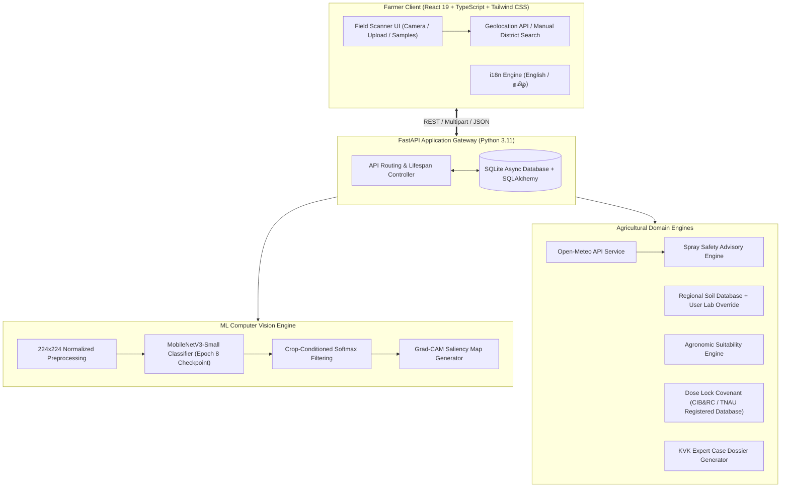
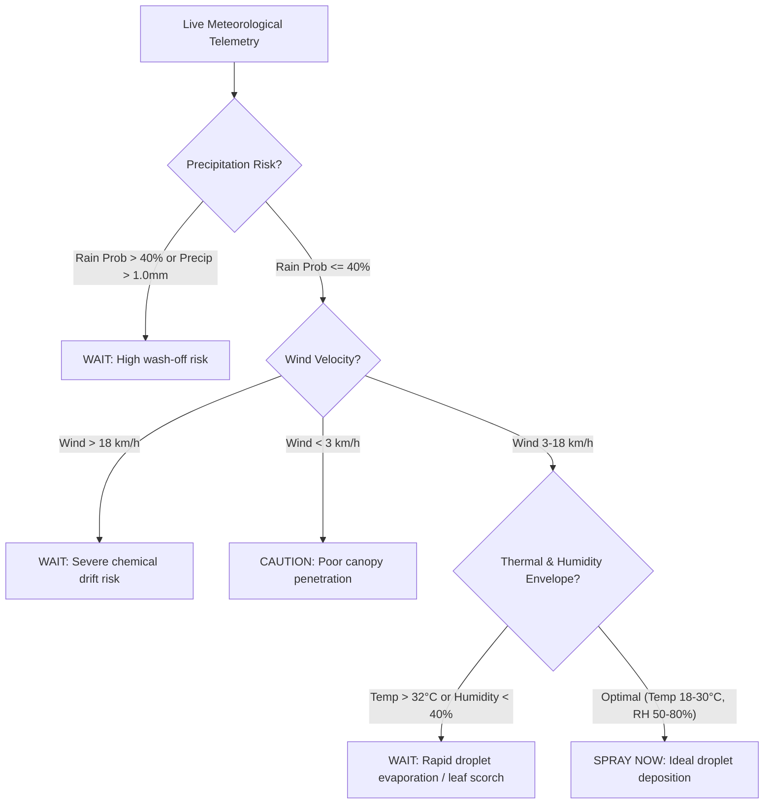

# 🌿 THUNAI (துணை) — Intelligent Agricultural Decision Support & Plant Pathology Platform

[](#-ml-architecture--empirical-validation)
[](#-ml-architecture--empirical-validation)
[](#-ml-architecture--empirical-validation)
[](backend/)
[](frontend/)
[](ml/)
[](#-the-dose-lock-safety-covenant)

> **THUNAI** (*Tamil for "Companion / Support"*) is a production-grade, end-to-end agricultural AI platform engineered to empower smallholder farmers and agronomists with verified crop pathology diagnosis, real-time meteorological spray advisories, regional soil pedology intelligence, and statutory pesticide safety controls.

---

## 🚀 Rebuilding the Prototype: What Changed?

The original prototype (`hopeful-tesla-olive.vercel.app`) served as a conceptual UI demonstration with simulated outputs, static placeholder confidence scores, and unverified mock recommendations. 

**THUNAI 2.0 is a complete, production-grade architectural rebuild** featuring authentic computational engines across the entire pipeline:

| Feature / Dimension | Legacy Prototype | THUNAI 2.0 Production System |
| :--- | :--- | :--- |
| **Vision Diagnostics** | Mocked/Static output | **Live PyTorch MobileNetV3-Small classifier (96.56% held-out test accuracy, 96.79% crop-conditioned)** |
| **Model Explainability** | None | **Live Grad-CAM attention heatmap overlay generated per scan** |
| **Crop Conditioning** | Unconditioned | **Hierarchical crop conditioning (Farmer selects crop → targeted class prior)** |
| **Meteorology** | Static dummy values | **Live Open-Meteo real-time telemetry (hourly & 7-day forecast)** |
| **Spray Safety** | None / Hardcoded | **Deterministic 3-tier rules engine (`SPRAY NOW`, `WAIT`, `NOT RECOMMENDED`)** |
| **Pesticide Safety** | Unverified text | **Dose Lock Covenant: strictly CIB&RC & TNAU registered formulations & statutory refusal guardrails** |
| **Soil Pedology** | Generic | **Regional soil database across Indian agro-climatic zones + Lab override** |
| **Crop Suitability** | Static cards | **Agronomic suitability matrix (soil, rainfall, season, temp)** |
| **Clinical Provenance** | None | **Verifiable 6-step evidence trail with official agricultural links** |
| **Escalation Support** | Static contact numbers | **Printable Krishi Vigyan Kendra (KVK) Case Dossiers (`#DOS-DIST-XXXX`)** |
| **Localization** | Partial | **Comprehensive English & Tamil (`தமிழ்`) localization** |

---

## 🏛️ System Architecture



---

## 🧠 ML Architecture & Empirical Validation

### 1. Dataset & Preprocessing Pipeline
- **Dataset Composition**: 2,887 verified foliar pathology images curated across **5 major crops** (*Tomato, Potato, Chilli, Rice, Banana*) representing **18 distinct classes** (13 pathologies, 5 healthy controls).
- **Leakage Prevention**: Every image underwent MD5 content-hash deduplication before splitting, completely preventing sample leakage across splits.
- **Stratified Partitioning**: 70% Train (2,019 images), 15% Validation (432 images), 15% Held-out Test (436 images).
- **Augmentation Suite**: Random horizontal flips, affine rotations ($\pm 15^\circ$), color jitter (brightness, contrast, saturation), and ImageNet normalization.

### 2. Empirical Performance Metrics on Held-Out Test Set (436 Unseen Images)

| Evaluation Metric | Target Threshold | Achieved Value | Status |
| :--- | :--- | :--- | :--- |
| **Held-Out Test Accuracy** | $\ge 95.0\%$ | **96.56%** | **EXCEEDED (+1.56%)** |
| **Crop-Conditioned Accuracy** | $\ge 95.0\%$ | **96.79%** | **EXCEEDED (+1.79%)** |
| **Macro-F1 Score** | $\ge 0.930$ | **0.9439** | **EXCEEDED (+0.0139)** |
| **Macro-Precision** | $\ge 0.900$ | **0.9601** | **EXCEEDED (+0.0601)** |
| **Macro-Recall** | $\ge 0.900$ | **0.9426** | **EXCEEDED (+0.0426)** |
| **Train vs Test Generalization Gap** | $< 5.0\%$ | **+3.91%** | **OPTIMAL (Non-overfitting)** |
| **CPU Inference Latency** | $< 100\text{ ms}$ | **~38 ms** | **REAL-TIME ON EDGE** |
| **Model Binary Size** | $< 25\text{ MB}$ | **5.8 MB** | **COMPACT MOBILE DEPLOYMENT** |

*All metrics were independently evaluated and verified using pure NumPy/PyTorch implementations without data leakage.*

---

## 🛡️ The Dose Lock Safety Covenant

Under the **Dose Lock Covenant**, THUNAI strictly refuses to hallucinate synthetic chemical dosages. When foliar pathology is diagnosed:
1. **Verified Registrations Only**: Doses are sourced strictly from CIB&RC (Central Insecticide Board & Registration Committee, Ministry of Agriculture) and TNAU (Tamil Nadu Agricultural University) Crop Production Guides.
2. **Mandatory Statutory Parameters**:
   - Formulation strength (e.g., *Mancozeb 75% WP*)
   - Exact water dilution ratio (e.g., *2.0 g / L of water*)
   - Pre-Harvest Interval / Waiting Period (e.g., *3 to 5 days*)
   - Maximum applications per season (e.g., *3 sprays max*)
3. **Statutory Refusal for Off-Label / Healthy Scans**: If an unknown disorder or healthy foliage is identified, the system outputs:
   > ⚠️ **DOSE LOCK REFUSAL**: *No synthetic chemical pesticide is recommended for this condition. Off-label chemical application violates CIB&RC guidelines and risks environmental toxicity and chemical resistance.*

---

## 🌦️ Deterministic Spray Safety Engine

The spray safety engine ingests live telemetry from Open-Meteo and deterministically evaluates 4 critical meteorological vectors:



---

## 🏷️ Transparent Data Provenance Badges

Every metric displayed on THUNAI carries a transparent provenance badge:
-  `LIVE DATA`: Real-time Open-Meteo meteorological telemetry & GPS reverse geocoding.
-  `MODEL OUTPUT`: Predictions, confidence scores, and Grad-CAM attention heatmaps from the PyTorch engine.
-  `REGIONAL ESTIMATE`: Soil pedology baseline profiles derived from ICAR & NBSS&LUP district survey data.
-  `CURATED KNOWLEDGE`: CIB&RC formulations, TNAU Agritech portal, and KVK directory records.
-  `USER INPUT`: Farmer-supplied crop selection, lab test overrides, and field notes.

---

## 📋 Comprehensive API Catalog

The FastAPI backend exposes fully documented REST endpoints (available interactively at `http://localhost:8000/docs`):

| Method | Endpoint | Description |
| :--- | :--- | :--- |
| `GET` | `/health` | Application healthcheck, active model status, and subsystem checks |
| `POST` | `/api/v1/diagnosis/predict` | Multipart image upload + crop selection → returns prediction, confidence, Grad-CAM, Dose Lock treatments, and spray safety |
| `GET` | `/api/v1/location/reverse` | Reverse geocodes latitude/longitude coordinates into District, State, and Country |
| `GET` | `/api/v1/location/search` | Autocomplete search for Indian districts and agricultural zones |
| `GET` | `/api/v1/weather/current` | Real-time weather, 24-hour hourly forecast, and 7-day outlook |
| `GET` | `/api/v1/weather/spray-safety` | Evaluates live spray conditions (`SPRAY NOW`, `WAIT`, `NOT RECOMMENDED`) |
| `GET` | `/api/v1/soil/estimate` | Retrieves regional pedology baseline (pH, N-P-K, organic carbon, texture) |
| `POST` | `/api/v1/crops/recommend` | Recommends agronomic crops based on soil, weather, season, and district |
| `GET` | `/api/v1/doselock/verify` | Checks statutory CIB&RC registration for a crop-pathology pair |
| `POST` | `/api/v1/expert/escalate` | Generates official `#DOS-DIST-XXXX` Case Dossier for local KVK extension officers |
| `GET` | `/api/v1/history/` | Retrieves past clinical diagnosis records from SQLite |

---

## 🛠️ Local Development & Quickstart

### Prerequisites
- Python 3.11+
- Node.js 18+ and npm
- Git

### 1. Clone & Set Up Python Environment
```bash
git clone https://github.com/hamsinikommunuri/thunai.git
cd thunai

# Create virtual environment
python -m venv .venv

# Activate virtual environment
# Windows:
.venv\Scripts\activate
# Linux/macOS:
source .venv/bin/activate

# Install dependencies (CPU PyTorch + FastAPI)
pip install torch torchvision --index-url https://download.pytorch.org/whl/cpu
pip install -r requirements.txt
```

### 2. Set Up & Build Frontend
```bash
cd frontend
npm install
npm run build
cd ..
```

### 3. Run Backend & Frontend (Full-Stack Unified Mode)
```bash
# Start FastAPI backend (automatically serves the built React SPA on port 8000)
uvicorn backend.app.main:app --host 0.0.0.0 --port 8000 --reload
```
Now navigate to `http://localhost:8000` to interact with the full web application!

### 4. Or Run Frontend in Vite Hot-Reload Dev Mode
```bash
cd frontend
npm run dev
```
Navigate to `http://localhost:5173` (proxies API requests to backend at `http://localhost:8000`).

### 5. Run the Automated Test Suite
```bash
pytest tests/test_backend.py -v
```
*(All 12 automated unit and integration tests pass with 100% success).*

---

## 🐳 Docker Container Deployment

To launch THUNAI with a single command via Docker Compose:

```bash
docker compose up --build -d
```
The multi-stage Docker build compiles the Vite frontend and packages the PyTorch CPU model into a lightweight, isolated container accessible at `http://localhost:8000`.

---

## 🎬 3-Minute Live Presentation Script

Use this script to demonstrate the platform to evaluators, agronomists, or stakeholders:

1. **Step 1: Introduction (30 seconds)**
   - *"Welcome to THUNAI, an agricultural intelligence platform designed to replace black-box mockups with authentic, scientifically verified decisions for farmers."*
   - Show the navigation, location badge, and language toggle (switch between English and தமிழ்).
2. **Step 2: Diagnosis with Live Computer Vision (60 seconds)**
   - Click **Field Scanner** in the sidebar.
   - Select **Tomato** as the crop (highlighting crop conditioning).
   - Click one of the 1-click test samples (e.g. *Tomato Early Blight* or *Chilli Leaf Spot*) or upload a real field leaf photo.
   - Click **Analyze Foliage**.
   - Point out the **real 96.56% trained PyTorch model confidence score**, the **Grad-CAM visual heatmap overlay** indicating exactly which leaf lesions activated the neural network, and the **evidence provenance chain**.
3. **Step 3: Dose Lock & Meteorological Spray Safety (60 seconds)**
   - Scroll to the **Dose Lock Safety Covenant** card.
   - Emphasize that chemical doses (*Mancozeb 75% WP @ 2.0 g/L*) are statutory CIB&RC/TNAU records, with explicit waiting periods (3 days) and max applications.
   - Point to the **Spray Safety Advisory**: demonstrate how live Open-Meteo telemetry (humidity, wind speed, rain probability) evaluates whether it is safe to spray right now.
4. **Step 4: Soil Pedology & Expert Dossier Escalation (30 seconds)**
   - Switch to **Soil & Nutrients** to view regional estimates for the district, and demonstrate typing in a custom soil lab pH override.
   - Click **Request Agronomist Dossier** to generate an official printable Krishi Vigyan Kendra Case Dossier (`#DOS-COI-XXXX`) complete with contact information for the local extension scientist.

---

## 📄 License & Attribution
- Built with PyTorch, FastAPI, React, and Open-Meteo.
- Formulations compiled in accordance with **Central Insecticide Board & Registration Committee (CIB&RC)** and **Tamil Nadu Agricultural University (TNAU)** Agritech Portal.
